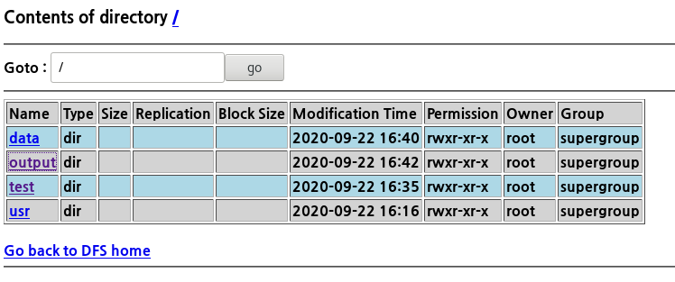
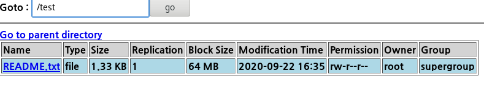
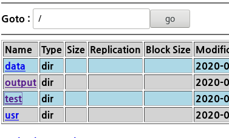
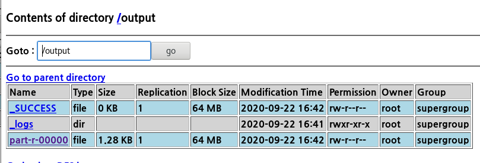

### Hadoop 이란

* 빅데이터의 시대


5V

기술적개념 + 

에코시스템과 함께


빅데이터 시스템 운영, 분석을 위한 어플 개발 , 빅데이터 시각화 visualize

저장된 데이터를 분석하고 통계화하기 때문에 보다 정확하게 결과를 추론할 수 있음


- Hadoop

대용량 데이터를 분산처리하는 자바기반의 오픈소스프레임워크

GFS, MapReduce - 데이터분석, 데이터 저장


- 왜 하둡을 사용하는가?

정형데이터 - 개인적 이체 , ERP 시스템과 같은 실시간 처리를 해야하는 것은 RDBMS

비정형데이터 - 웹로그 같은 텍스트덩어리 

비정형데이터는 크기가 너무 큼 

그래서 기존의 rbBMS에 저장할 수 없다

리눅스위의 하둡은 만약 내가 컴퓨터 세대로 구축했는데 필요하면 컴퓨터를 쉽게 증가시킬 수 있다 . 

RAID 의 하드디스크 저장 방식이 빅데이터 환경 구축의 시작점

빅데이터 하둡도 두대가 부셔져도 다시 복구가능하고 다시 두대를 설치할 수 있다.

그 빅데이터 시스템을 운영할 수 있는 인력을 가장 많이 필요로 한다.


데이터서버에서 데이터를 처리하는 방식이지만 

하둡은 여러대의 컴퓨터에 데이터를 저장- RAID 5  1기가가 여러개로 쪼개서 저장되는 것처럼

30기가 덩어리 하나에서 돌아가면 속도가 느려지는데 용량을 쪼개서 돌아가면 처리시간은 더 빨라진다

한대의 컴퓨터가 하는 것이 아니고 여러대의 컴퓨터에 분산저장 후 그 데이터를 각 컴퓨터는 분석하고

하둡은 그 결과를 취합한다. 이러한 분산 컴퓨팅 (컴퓨터를 여러대 설치하고 하나의 네트워크를 설치해서 사용하는 것 ) 기술을 통해서 데이터 분석방법 제공해줌 


열대에 분산되어 저장도 할 수있고 그것을 pdf로 변환 할 수 있는 처리를 할 수 있는 

즉 분산되어 저장, 분산되어 처리할 수 있는 하둡의 분산환경을 구축할 수 있다.


클라우드 환경에서 운영할 수 있는 인력

vmware와 비슷하게 생각

가상의 세계에 여러대의 컴퓨터를 설치해서 운영하는 것 -> 클라우드 쪽으로 관심 

그루터 BI,DW 


#### Hadoop ecosystem

하둡의 메인 코어 시스템  - HDFS , MapReduce

version 2.0 core system - YARN

이 외의 나머지 것들이 hadoop ecosystem


하둡시스템 구축하려면

HDFS(hadoop file system) , MapReduce 

Hive - sql 구문을 사용해 빅데이터 분석함

빅데이터 시스템 구축을 위한 방편으로

기존의 rdbms를 대체할 수는 없으며 빅데이터를 분석,저장,수집하는데 하둡 이용


> **배치성**이란 ?

실시간으로 빅데이터 시스템에 저장하는 것이 아님

웹에서 클릭하면 데이터 시스템에 로그파일로 남김 -> 주기적으로 몇시에 이 파일을 

하둡안으로 집어넣음  이것을 배치성

ex) 크론탭- 스크립트에 적어놓으면 주기적으로 파일을 쌓을 수 있다. 

리눅스의 크론탭과 비슷함 

신호등의 iot 장비에서 공기에 대한 내용 자동차의 대한 내용은 웹애플리케이션이 받아서

데이터에 계속 쌓는다 하둡에 쌓아 올리는 것이 아니라

rdbs에 쌓을 데이터와 로그에 남길 데이터를 구분해야 한다.  

자동차의 데이터를 로그로 쌓고 주기적으로 빅데이터 시스템에 쌓아 놓는다.  쌓여진 데이터를 분석하고 ai 기계 학습


> 하둡에 hive 붙여서 visualize , R 이용해 분석 

> 문맥의 흐름이 끊임이 없어야 하고 rollback 가능 but hadoop 은 트랜젝션 안됨

하둡은 데이터를 저장하고 처리 

HA (high availability) - 현재 시스템의 오류를 막기 위해 -> 증권,은행 

ds 센터 -  

하둡시스템에서 데이터의 수정은 불가

append 는 가능 

POSIX 리눅스에서 사용한 명령어 


우리는 세대를 구축해서 - 리눅스 세개 

### Hadoop install

1. 리눅스 , 자바 준비

namenode 가 secondary , 분산환경의 컴퓨터 간의 이동이 자유로워야 한다

SSH 란?

자유롭게 들어가야 한다-> 다른 컴퓨터의 계정을 모두 알아야 한다-> 보안처리 되어 네트워크 실행 

SSH 해야한다 

한대에 모두 구축하는 시스템에도 SSH 를 사용해야 하는데

내 컴퓨터에서도 자유롭게 못들어감

그래서 SSH 설정해야함

``` bash
# ssh hadoopserver
The authenticity of host 'hadoopserver (192.168.111.119)' can't be established.
ECDSA key fingerprint is SHA256:3U9i3AS0BDhM2Wpw0euJlTkrlh/jOrbxX1CV/uBLufk.
ECDSA key fingerprint is MD5:52:21:77:db:50:36:7b:ea:b4:91:09:5c:14:64:72:fe.
Are you sure you want to continue connecting (yes/no)? y
Please type 'yes' or 'no': yew
Please type 'yes' or 'no': yes
Warning: Permanently added 'hadoopserver,192.168.111.119' (ECDSA) to the list of known hosts.
root@hadoopserver's password: 

```

 

왜? 네임노드에서 세컨더리 제어하려면 내 컴퓨터에서 나갔다가 들어가야 한다 

들어가 있는 상태에서는 들어갈 수는 없다. 자기 자신을 나갔다가 다른ㄱ 곳으로 들어가야함


```bash
# 1. Firewall stop
$ systemctl stop firewalld
$ systemctl disable firewalld
```


\1. Firewall stop

\- systemctl stop firewalld

\- systemctl disable firewalld


\2. hostname 변경

\- hostnamectl set-hostname server1

\- vi /etc/hosts

192.168.111.101 server1 


\3. hadoop 설치


wget https://archive.apache.org/dist/hadoop/common/hadoop-1.2.1/hadoop-1.2.1.tar.gz

/usr/local에 복사

vi /etc/profile

HADOOP_HOME 지정


> 4. 보안 설정

```bash
#컴퓨터들끼리 들어갔다 나갔다가 할 수 있는 키를 만들어줘야 한다.

[root@hadoopserver2 hadoop-1.2.1]# ssh-keygen -t dsa -P '' -f ~/.ssh/id_dsa

Generating public/private dsa key pair.
Your identification has been saved in /root/.ssh/id_dsa.
Your public key has been saved in /root/.ssh/id_dsa.pub.
The key fingerprint is:
SHA256:OF+KUDaqj9s1HzkeonORExU8vaXHtBx+KYf7B3oBR54 root@hadoopserver
The key's randomart image is:
+---[DSA 1024]----+
|       ..o       |
|        + . + .  |
|      +. . O * o |
|     +.o  o X E  |
|    o ooS .. B   |
|   . .++ +  . o  |
|  .   =oB    o o |
|   +.o.= +  . o .|
|  o.+o  o    . . |
+----[SHA256]-----+

[root@hadoopserver ~]# cd .ssh
[root@hadoopserver .ssh]# ls
id_dsa  id_dsa.pub  known_hosts

[root@hadoopserver2 hadoop-1.2.1]# cat id_dsa.pub >> authorized_keys
#public 키를 가지고 namenode는 다른 컴퓨터로 들어감
#private 키와 맞춰봄 
#내 컴퓨터에 퍼블릭키와 프라이빗 키를 만들어 줌configuration
```

> 5. configuration

\- core-site.xml

<configuration>

<property>

<name>fs.default.name</name> 

<value>hdfs://localhost:9000</value>

</property>

<property>

<name>hadoop.tmp.dir</name>

<value>/usr/local/hadoop-1.2.1/tmp</value>

</property>

</configuration>


# 파일 하나 집어넣으면 복제를 몇개할래?
# 웹접근 가능?
# namenode가 대장, 여러대의 컴퓨터의 정보를 어떤 폴더에 저장함.
# 실제로 10기가 파일들은 어떤 폴더에 넣을 건지 
\- hdfs-site.xml

<configuration>

<property>

<name>dfs.replication</name>

<value>1</value> 

</property>

<property>

<name>dfs.webhdfs.enabled</name>

<value>true</value>

</property>

<property>

<name>dfs.name.dir</name>

<value>/usr/local/hadoop-1.2.1/name</value>

</property>

<property>

<name>dfs.data.dir</name>

<value>/usr/local/hadoop-1.2.1/data</value>

</property>

</configuration>


\- mapred-site.xml
# job-tracker - 각각의 데이터 로드에있는 것들을 처리하는 프로세서를 의미함 
# 분석 처리를 위함
<configuration>

<property>

<name>mapred.job.tracker</name>

<value>localhost:9001</value>

</property>

</configuration>


#cd conf 안에 환경설정 파일이 모두 들어있다.

\- hadoop.env.sh

9 export JAVA_HOME=/usr/local/jdk1.8.0

10 export HADOOP_HOME_WARN_SUPPRESS="TRUE"


\6. Hadoop 실행

hadoop namenedo -format

start-all.sh

jps

### hadoop 실행  

http://hadoopserver:50070 

```bash
[root@hadoopserver ~]# hadoop fs -ls /usr
Found 1 items
drwxr-xr-x   - root supergroup          0 2020-09-22 16:16 /usr/local

[root@hadoopserver ~]# cd /usr/local/hadoop-1.2.1/
[root@hadoopserver hadoop-1.2.1]# ls
CHANGES.txt  contrib                       hadoop-test-1.2.1.jar   sbin
LICENSE.txt  data                          hadoop-tools-1.2.1.jar  share
NOTICE.txt   docs                          ivy                     src
README.txt   hadoop-ant-1.2.1.jar          ivy.xml                 tmp
bin          hadoop-client-1.2.1.jar       lib                     webapps
build.xml    hadoop-core-1.2.1.jar         libexec
c++          hadoop-examples-1.2.1.jar     logs
conf         hadoop-minicluster-1.2.1.jar  name


```


> 폴더를 생성해보자

```bash
#### test 폴더가 생성됨
[root@hadoopserver hadoop-1.2.1] # hadoop fs -mkdir /test
```



```bash
### test 폴더에 README.txt 넣어라 (README는 hadoop-1.2.1 안에 있는 파일 )
[root@hadoopserver hadoop-1.2.1]# hadoop fs -put README.txt /test
```



```bash
### 폴더 삭제 하는 방법 ###
[root@hadoopserver hadoop-1.2.1]# hadoop fs -rmr /result 
Deleted hdfs://localhost:9000/result

### 폴더 생성 방법 ###
[root@hadoopserver hadoop-1.2.1]# hadoop fs -mkdir /data 

### test 폴더의 파일을 읽어서 분석한 후 
### output 폴더에 분석결과 넣어라 
[root@hadoopserver hadoop-1.2.1]# hadoop jar hadoop-examples-1.2.1.jar wordcount /test /output


```



output 폴더에 들어가면



test 폴더의 README.txt 를 분석한 결과를 볼 수 있다.


