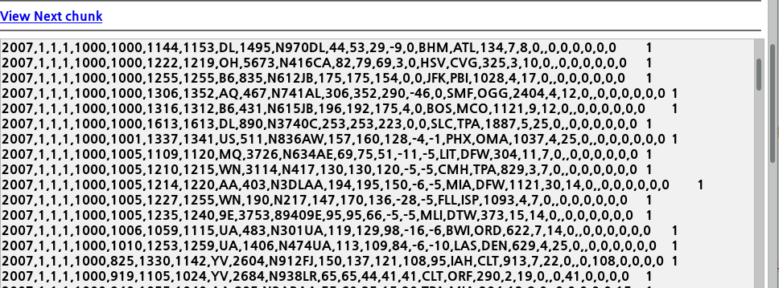

mainserver

namenode - jobtracker

192.168.111.120


secondserver

secondary namenode

DataNode

TaskTraker 

192.168.111.121


dataserver

192.168.111.121


datanode는 계속 증가시킬 수 있음

ssh - 두개의 컴퓨터에 자유롭게 왔다갔다 할 수 있도록 세팅

초기상태에서 hostname, ip adress 설정 방법

Jdk 설치 설정방법

ssh 권한 부여하기 


### jdk 설치

```bash
oracle 사이트에서 jdk 설치한 후
# cd 다운로드
# tar xvf jdk...gz
# mv jdk1.8... jdk1.8.0
# cp -r jdk1.8.0 /usr/local
# vi /etc/profile
52 JAVA_HOEM=/usr/local/jdk1.8.0
53 CLASSPATH=/usr/local/jdk1.8.0/lib
54 export JAVA_HOME CLASSPATH
55 PATH=$JAVA_HOME/bin:$PATH:.
# cd /usr/bin 
# ls -l java  // java 확인
# rm java     // symbol link 지우기
# ln -s /usr/local/jdk1.8.0/bin/java java   //symbol link 생성
# java -version 
Java(TM) SE Runtime Environment..
```


### SSH 설정

#### 분산시스템

> 하나의 서버에 분산시스템 구축하기

```bash
[root@mainserver ~]# -keygen -t dsa -P '' -f ~/.ssh/id_dsa
[root@mainserver ~]# ls .ssh
id_dsa id_dsa.pub 

## 나 자신도 왔다갔다 할 수 있는 키 생성
```


### SSH 설정

#### 완전분산시스템

```bash

```


``` bash
[root@mainserver ~]# ssh root@dataserver mv jdk1.8.0_261 jdk1.8.0
[root@mainserver local]# scp hadoop.tar.gz root@secondserver:/usr/local
[root@mainserver local]# ssh root@secondserver tar xvf /usr/local/hadoop.tar.gz
```


### 서버제어하기

```bash
hadoop fs -mkdir /air

hadoop fs -put 2007.csv /air

[root@mainserver 다운로드]# cd /usr/local/hadoop-1.2.1/
[root@mainserver hadoop-1.2.1]# hadoop jar hadoop-examples-1.2.1.jar wordcount /air /output
```

웹에서 

data server는 하나의 

tasktracker가 일해서 값을 주면 jobtracker는 모든 결과를 취합해서 웹으로 전해줌

메인이 특정 노드를 알려주면 데이터서버에서 세컨드로 가고 

stop-all.sh

name, data, tmp 삭제 

trouble shooting 

hadoop namenode -format

start-all.sh

### Map Reduce


네임노드의 잡트래커에게 요청

네임노드의 잡트래커는 (keyvalue로 분류해서 맵 만듬)  -> 각데이터 노드의 tasktracker에 요청을 함

결과를 하트비트에 태워서 보내고 집계된 파일을 분석해서 클라이언트에 보낸다. (page 101-103) 

우리는 hive 사용하여 심플하게 map reduce 구성하려고 함 - (page  564)

```bash
###데이터 다운
https://dataverse.harvard.edu/dataset.xhtml?persistentId=doi:10.7910/DVN/HG7NV7

### zip 파일 풀기
[root@mainserver 다운로드]# bzip2 -d 2007.csv.bz2

### 디렉토리 생성
[root@mainserver 다운로드]# hadoop fs -mkdir /air

### air 폴더에 파일 이동
[root@mainserver 다운로드]# hadoop fs -put 2007.csv /air

### hadoop 파일로 이동
[root@mainserver 다운로드]# cd /usr/local/hadoop-1.2.1/

### mapreduce 실행하기
### jar 의 wordcount 클래스 실행해서 
[root@mainserver hadoop-1.2.1]# hadoop jar hadoop-examples-1.2.1.jar wordcount /air /output


```



```bash
[root@mainserver hadoop-1.2.1]# hadoop fs -get /output/part-r-00000 result.txt
어떤폴더의 무엇을 어떤파일로 가져오겠다

[root@mainserver hadoop-1.2.1]# hadoop fs -getmerge /output resultall.txt
폴더의 모든 파일을 resultall 파일로 가져오겠다
```


### HIVE

> HIVE 활용해서 데이터 쉽게 분석하기


### Maria DB  설치 

HIVE 를 사용하려면 Maria Db 를 설치해야 한다.

1. sql 구문으로 hive 에게 요청
2. hive 가 sql 구문 분석해서 mapreduce 요청 
3. mapreduce 분석해서 