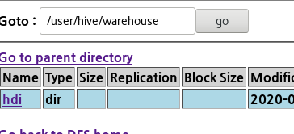
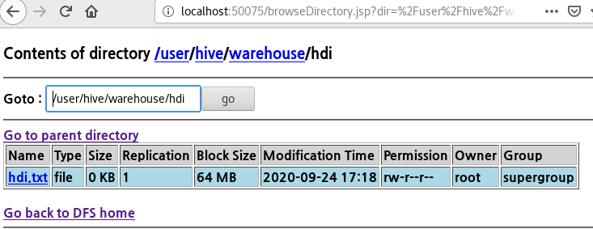
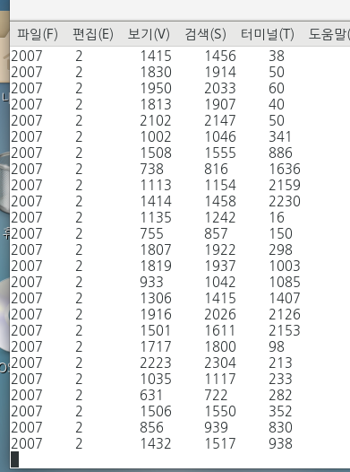
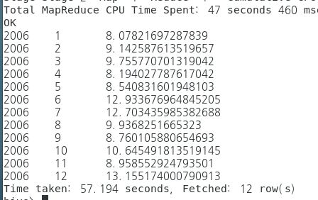
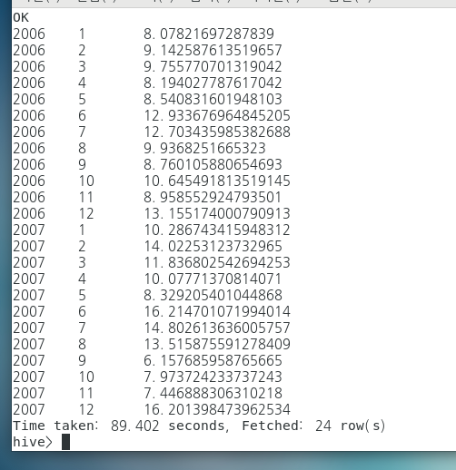
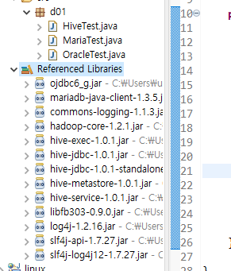
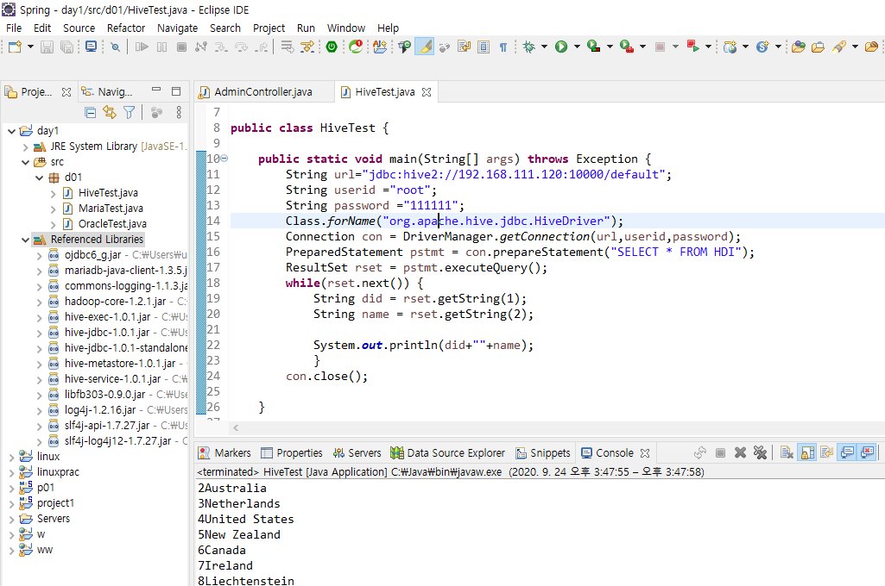

### Hive

Hive 실행 전

- [ ] Jdk 설치
- [ ] maria db 설치
- [ ] hadoop 설치  (jps 실행 후 node 출력 되는 것 확인)


hive 

maria db

데이터노드에 데이터가 들어가고 구조만 마리아 디비에 저장됨

데이터 덩어리가 들어가 있는데 데이터 구조를 보고 분석을 함

우린 sql요청하면 자동으로 하이브에서 맵리듀스 프로그램 만들어지고 데이터노드에 요청하고 결과를 받음

### Maria db 권한 부여

```bash
[root@dataserver ~]# mysqladmin -u root password '111111'
[root@dataserver ~]# mysql -h localhost -u root -p
Enter password: 

Welcome to the MariaDB monitor.  Commands end with ; or \g.
Your MariaDB connection id is 5
Server version: 10.0.15-MariaDB MariaDB Server
Copyright (c) 2000, 2014, Oracle, SkySQL Ab and others.
Type 'help;' or '\h' for help. Type '\c' to clear the current input statement.

MariaDB [(none)]> USE mysql;
Reading table information for completion of table and column names
You can turn off this feature to get a quicker startup with -A

Database changed
MariaDB [mysql]> GRANT ALL ON *.* TO hive@'127.0.0.1' IDENTIFIED BY '111111';
Query OK, 0 rows affected (0.00 sec)

##localhost 이름의 서버는 hive란 이름을 가지고 있으면 mysql에 접속할 수 있는 권한을 부여함
MariaDB [mysql]> GRANT ALL ON *.* TO hive@'localhost' IDENTIFIED BY '111111';
Query OK, 0 rows affected (0.00 sec)

MariaDB [mysql]> GRANT ALL ON *.* TO hive@'192.168.111.122' IDENTIFIED BY '111111';
Query OK, 0 rows affected (0.00 sec)

MariaDB [mysql]> GRANT ALL ON *.* TO hive@'hadoop' IDENTIFIED BY '111111';
Query OK, 0 rows affected (0.00 sec)
MariaDB [mysql]> exit

### hive의 이름으로 localhost 에게 mysql 들어가게 해달라고 요청함
### localhost야 hive 접속 허용해줘
[root@dataserver ~]# mysql -h localhost -u hive -p 
Enter password: 

Welcome to the MariaDB monitor.  Commands end with ; or \g.
Your MariaDB connection id is 6
Server version: 10.0.15-MariaDB MariaDB Server
Copyright (c) 2000, 2014, Oracle, SkySQL Ab and others.
Type 'help;' or '\h' for help. Type '\c' to clear the current input statement.

### DATABASE 이름 설정하기
MariaDB [(none)]> CREATE DATABASE hive_db;
Query OK, 1 row affected (0.00 sec)

```


### HIVE 설치

``` bash
##환경변수가 전역변수로 바뀌지 않기 때문에 꼭 리부트 해주기
[root@hadoop ~]# vi /etc/profile

52 JAVA_HOME=/usr/local/jdk1.8.0
53 CLASSPATH=/usr/local/jdk1.8.0/lib
54 HADOOP_HOME=/usr/local/hadoop-1.2.1
55 HIVE_HOME=/usr/local/hive
56 
57 export JAVA_HOME CLASSPATH HADOOP_HOME HIVE_HOME
58 
59 PATH=$JAVA_HOME/bin:$HADOOP_HOME/bin:$HIVE_HOME/bin:.:$PATH

[root@hadoop ~]# tar xvf apache-hive-1.0.1-bin.tar.gz 

[root@hadoop ~]# mv apache-hive-1.0.1-bin hive
[root@hadoop ~]# cp -r hive /usr/local
[root@hadoop ~]# cd /usr/local
[root@hadoop local]# ls
bin  games         hadoop.tar.gz  include   lib    libexec  share
etc  hadoop-1.2.1  hive           jdk1.8.0  lib64  sbin     src

[root@hadoop local]# cd hive
[root@hadoop hive]# ls
LICENSE  README.txt         bin   examples  lib
NOTICE   RELEASE_NOTES.txt  conf  hcatalog  scripts
[root@hadoop hive]# cd conf
[root@hadoop conf]# ls
beeline-log4j.properties.template  hive-exec-log4j.properties.template
hive-default.xml.template          hive-log4j.properties.template
hive-env.sh.template

[root@hadoop ~]# cd 다운로드 
[root@hadoop 다운로드]# ls
2006.csv      2008.csv.bz2
2006.csv.bz2  MariaDB-10.0.15-centos7_0-x86_64-client.rpm
2007.csv      MariaDB-10.0.15-centos7_0-x86_64-common.rpm
2007.csv.bz2  MariaDB-10.0.15-centos7_0-x86_64-server.rpm
2008.csv      mariadb-java-client-1.3.5.jar
[root@hadoop 다운로드]# cp mariadb-java-client-1.3.5.jar  /usr/local/hive/lib

[root@hadoop 다운로드]# cd /usr/local/hive
[root@hadoop hive]# ls
LICENSE  README.txt         bin   examples  lib
NOTICE   RELEASE_NOTES.txt  conf  hcatalog  scripts
[root@hadoop hive]# cd conf
[root@hadoop conf]# vi hive-site.xml
<?xml version="1.0"?>
<?xml-stylesheet type="text/xsl" href="configuration.xsl"?>
<configuration>

    <property>

        <name>hive.metastore.local</name>

        <value>false</value>

        <description>controls whether to connect to remove metastore server or open a new metastore server in Hive Client JVM</description>

    </property>

    <property>

        <name>javax.jdo.option.ConnectionURL</name>

        <value>jdbc:mariadb://localhost:3306/hive_db?createDatabaseIfNotExist=true</value>

        <description>JDBC connect string for a JDBC metastore</description>

    </property>

    <property>

        <name>javax.jdo.option.ConnectionDriverName</name>

        <value>org.mariadb.jdbc.Driver</value>

        <description>Driver class name for a JDBC metastore</description>

    </property>

    <property>

        <name>javax.jdo.option.ConnectionUserName</name>

        <value>hive</value>

        <description>username to use against metastore database</description>

    </property>

    <property>

        <name>javax.jdo.option.ConnectionPassword</name>

        <value>111111</value>

        <description>password to use against metastore database</description>

    </property>

</configuration>

[root@hadoop ~]# start-all.sh
[root@hadoop ~]# jps
6291 NameNode
6549 SecondaryNameNode
6410 DataNode
6924 Jps
6653 JobTracker
6782 TaskTracker

```

 ```bash
### 정확하게 만들어줘야함
[root@hadoop ~]# hadoop fs -mkdir /tmp
[root@hadoop ~]# hadoop fs -mkdir /user/root/warehouse
[root@hadoop ~]# hadoop fs -chmod 777 /tmp
[root@hadoop ~]# hadoop fs -chmod 777 /user/root/warehouse
[root@hadoop ~]# hadoop fs -mkdir /tmp/hive
[root@hadoop ~]# hadoop fs -chmode 777 /tmp/hive
[root@hadoop ~]# hadoop fs -chmod 777 /tmp/hive
[root@hadoop ~]# start-all.sh
[root@hadoop conf]# hive

 ```

```bash
### hdi 예제 실행해보기

1.table 생성

hive> CREATE TABLE HDI(id INT, country STRING, hdi FLOAT, lifeex INT, mysch INT, eysch INT, gni INT) ROW FORMAT DELIMITED FIELDS TERMINATED BY ',' STORED AS TEXTFILE;

2. 데이터 업로드 하기 
   - 우린 /root/hdi.txt 파일 사용
hive> LOAD DATA LOCAL INPATH '/root/hdi.txt' OVERWRITE INTO TABLE hdi;

Loading data to table default.hdi
Table default.hdi stats: [numFiles=1, numRows=0, totalSize=0, rawDataSize=0]
OK
Time taken: 1.033 seconds

   
```



요렇게 warehouse 아래의 테이블 hdi로 들어가면 

업로드 해준 hdi.txt 파일의 구조가 업로드 된걸 확인할 수 있다.



CREATE TABLE HDI(id INT, country STRING, hdi FLOAT, lifeex INT, mysch INT, eysch INT, gni INT) ROW FORMAT DELIMITED FIELDS TERMINATED BY ',' STORED AS TEXTFILE;

테이블 명칭은 대소문자 구문

데이터를


[root@hadoop 다운로드]# mv 2007.* /root

[root@hadoop ~]# more 2006.csv 


PARTITIONED BY 2006디렉터리 아래

2006년 데이터를 조회하고 싶으면 하나의 디렉터리만 조회할 수 있도록 

이 데이터가 들어갈 디렉토리 

ROW~ : 

LINE : 라인이 끝날 때는 이런식으로 문장이 끝남 문장 끝나는 걸 알려주기 위해 


USER/HIVE/

```bash
hive> LOAD DATA LOCAL INPATH '/root/2007.csv' OVERWRITE INTO TABLE airline_delay 
    > PARTITION (delayYear='2007');
Loading data to table default.airline_delay partition (delayyear=2007)
Partition default.airline_delay{delayyear=2007} stats: [numFiles=1, numRows=0, totalSize=702878193, rawDataSize=0]
OK
Time taken: 19.573 seconds

MAPREDUCE 돌아서 잡트래커에게 요청 하면 태스크트ㅐㄹ커에게 요청하면 잡트래커가 취합해서 결과 알려줌
mAPREDUCE 프로그램 안짜고 SQL 날리면 HIVE가 잡트래커에게 요청하면 결과를 가져옴

```

```BASH
hive> SELECT year, month, deptime, arrtime, flightnum FROM airline_delay
    > WHERE delayYear = '2006'
    > LIMIT 10;
OK
NULL	NULL	NULL	NULL	NULL
2006	1	743	1024	343
2006	1	1053	1313	613
2006	1	1915	2110	617
2006	1	1753	1925	300
2006	1	824	1015	765
2006	1	627	834	295
2006	1	825	1041	349
2006	1	942	1155	356
2006	1	1239	1438	775
Time taken: 0.346 seconds, Fetched: 10 row(s)

```



```bash
### 년도 별 출발 지연 시간 , 도착 지연 시간의 평균을 구하시오
hive> SELECT Year,avg(ArrDelay),avg(DepDelay) FROM airline_delay
    > GROUP BY Year;
    
MapReduce Total cumulative CPU time: 2 minutes 0 seconds 100 msec
Ended Job = job_202009241408_0002
MapReduce Jobs Launched: 
Stage-Stage-1: Map: 6  Reduce: 7   Cumulative CPU: 120.1 sec   HDFS Read: 1609095114 HDFS Write: 123 SUCCESS
Total MapReduce CPU Time Spent: 2 minutes 0 seconds 100 msec
OK
2007	10.19218057072105	11.399141744487839
2008	10.27356916693868	11.436358787409533
2006	8.6828402630457	10.09364218286413

```

```bash
### 2008년 월 별 출발 도착 지연 시간의 평균을 구하시오
비정형데이터를 출력할 수 있음
SELECT 
WHERE delayYear
OR
GROUP BY 
ORDER BY 
```





이걸 연동해서 자바 어플리케이션과 연동 

```BASH
hive> SELECT Year, Month,avg(DepDelay) FROM airline_delay
    > WHERE delayYear=2006                            
    > GROUP BY Year, Month                            
    > HAVING Month >= 10;

MapReduce Total cumulative CPU time: 42 seconds 410 msec
Ended Job = job_202009241408_0009
MapReduce Jobs Launched: 
Stage-Stage-1: Map: 3  Reduce: 3   Cumulative CPU: 42.41 sec   HDFS Read: 672110223 HDFS Write: 80 SUCCESS
Total MapReduce CPU Time Spent: 42 seconds 410 msec
OK
2006	10	10.645491813519145
2006	11	8.958552924793501
2006	12	13.155174000790913
Time taken: 38.465 seconds, Fetched: 3 row(s)

```

MAP-TASKT

REDUCE-JOBT

장점

1.MAPREDUCE 로 변경

2.비정형 > 정형 데이터로 볼 수있음


자바에서 하이브로 들어감

자바프로그램에서 오라클로 들어가려면 - 자바 애플리케이션에서 들어오기를 기다리는 1521포트가 있어야 하는 것 처럼

하이브에서 자바애플리케이션을 들어오는것을 기다리니까 하이브가 기다리는 명령이 



하둡 투에 하둡과 마이에스큐엘 실행

하이브 설치

하이브예제 실행

air data 입력 및 분석

java application 




[root@hadoop ~]# hive --service hiveserver2

사용일자,노선명,역ID,역명,승차총승객수,하차총승객수,등록일자