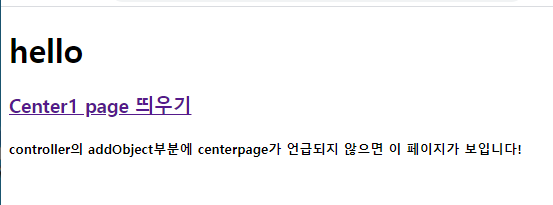
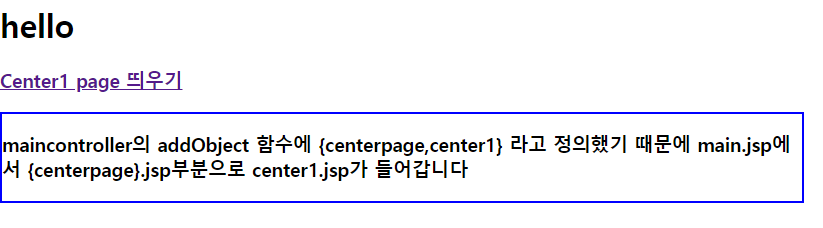

#### oracle에 저장된 데이터 출력하기

```java
public static void main (String[] args) throws Execption{
    String url=
    String id=
    String password=
    Class.forName();
    //db에 들어감, 들어가는 함수 이름을 con 
    Connection con = DriverManager.getConnection(url,id, password);
    //db의 테이블 가져올 함수와 그 함수 이름은 pstmt
    //저장된 값을 가져와라 pstmt야 
    PreparedStatement pstmt = con.prepareStatement("SELECT*FROM ITEMS")
    //테이블이 저장된 함수의 이름 ps
    ResultSet rset = pstmt.executeQuery();
   
    while(rset.next()){
        String did = rset.getString();
        String name = rset.getString();
        int price = rset.getInt();
        System.out.println(did+""+name+""+price);
    }
        con.close();
}
```


#### 화면 전환 없이 다른 페이지 띄우기

```javascript
//main.jsp
<body>
	<h1>hello</h1>
	<h3>
		<a href="center1.mc">Center1 page 띄우기</a>
	</h3>
	
	<c:choose>
		<c:when test="${centerpage==null}">
			<jsp:include page="center.jsp"></jsp:include>
		</c:when>
		<c:otherwise>
			<jsp:include page="${centerpage}.jsp"></jsp:include>
		</c:otherwise>
	</c:choose>

</body>

//center.jsp
<%@ page language="java" contentType="text/html; charset=UTF-8"
    pageEncoding="UTF-8"%>
<!DOCTYPE html>
<html>
<head>
<meta charset="UTF-8">
<title>Insert title here</title>
</head>
<body>
//페이지는 다른 페이지이지만 controller에서 어떤 페이지로 가라고 언급하지 않으면 
//화면 아랫부분에 centerpage내용 출력한다.
<h5>
controller의 addObject부분에 centerpage가 언급되지 않으면
이 페이지가 보입니다!
</h5>

</body>
</html>

```

> 화면에 보이는 모습을 나타낸다.





> Center1 page라는 부분을 클릭하면 화면 전환없이 main.jsp에 클릭하면 나오는 화면 띄우기



``` javascript
//Center1누르면 다른 페이지 보여줘야하니까
//페이지를 출력하기 위해 controller에서 어떤 페이지를 보여주라고 적어준다.
//위의 main.jsp에서 Center1 page띄우기를 누르면 center1.jsp로 이동하라고 했으니까
// "/center1.mc"페이지를 뿌리기 위해 어떻게 해야하는지 아래에 적어준다.

//MainController
@RequestMapping("/center1.mc") 
	public ModelAndView center1(){
		ModelAndView mv = new ModelAndView();
		mv.addObject("centerpage","center1");
		mv.setViewName("main");
		return mv;
    }

//main.jsp
<c:choose>
		<c:when test="${centerpage==null}">
			<jsp:include page="center.jsp"></jsp:include>
		</c:when>
		<c:otherwise>
			<jsp:include page="${centerpage}.jsp"></jsp:include>
		</c:otherwise>
	</c:choose>

```

main.jsp에서 {centerpage}라고 적어준 부분에 center1페이지를 넣으라고 해주었고

addObject함수를 통해 centerpage에 center1을 넣으라고 적어줌 

setViewName - 뒷 배경 페이지는 어떤 페이지로 둘지

---> 즉 , addObject를 통해 페이지를 뿌리라고 하면

​       center1.jsp의 페이지로 전환하지 않고 

​       원래 페이지에 center1.jsp를 출력할 수 있다.

 

#### 화면전환 없이 highchart를 출력해보자 

##### 1. 랜덤으로 log 찍기

##### 2. 로그 hadoop에 저장하기

##### 3. hive로 분석한 후 

##### 4.highchart에 json형태로 출력하기


> log 찍기 위한 준비

1. /WEB-INF에 log4j.properties파일 추가
2. com.loggers파일 생성하기
3. constructor생성
4. 


