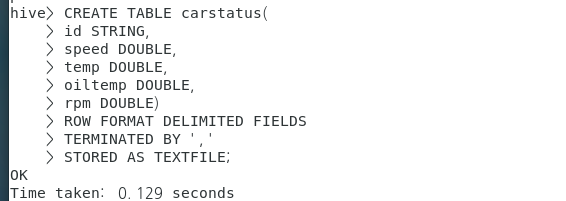
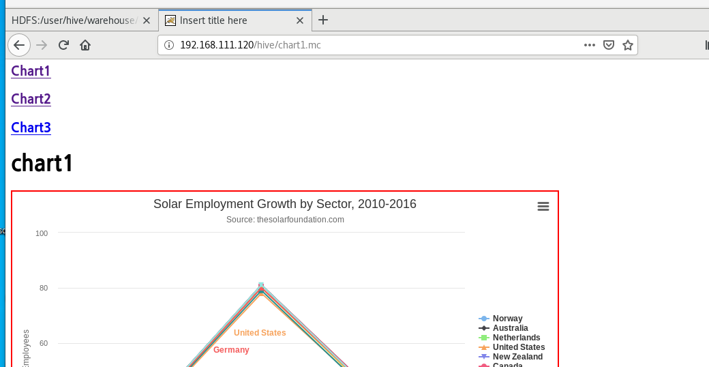
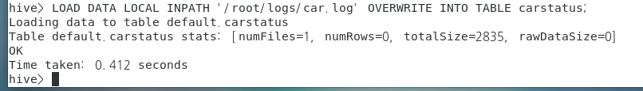
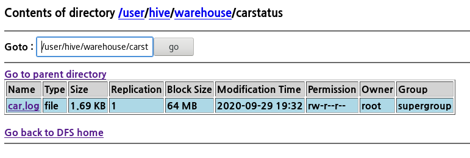
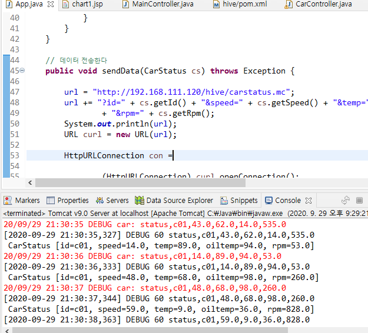

### HIVE 실행 준비

1. JDK 설치
2. Maria db 설치 - 테이블 구조 저장
3. Hadoop 설치
4. Apache tomcat 설치 

### hadoop 실행


##### - 테이블 생성 



### log 구현

```java
//임의의 데이터 값 출력
package hiveapp;

import java.net.HttpURLConnection;
import java.net.URL;
import java.util.Random;

public class App {

	String url;

	public App() {

	}

	// 센서에서 데이어 받아옴
	public void getData() {
		for (int i = 1; i <= 1500; i++) {

			Random r = new Random();
			double speed = r.nextInt(200);
			double temp = r.nextInt(100);
			double oiltemp = r.nextInt(100);
			double rpm = r.nextInt(1500);

			CarStatus cstatus = new CarStatus("c01", speed, temp, oiltemp, rpm);

			try {
				sendData(cstatus);
				System.out.println("Send Data..." + speed);
			} catch (Exception e1) {
				// TODO Auto-generated catch block
				e1.printStackTrace();
			}

			try {
				Thread.sleep(1000);
			} catch (InterruptedException e) {
				// TODO Auto-generated catch block
				e.printStackTrace();
			}
		}
	}

	// 데이터 전송한다
	public void sendData(CarStatus cs) throws Exception {

		url = "http://127.0.0.1/hive/carstatus.mc";
		url += "?id=" + cs.getId() + "&speed=" + cs.getSpeed() + "&temp=" + cs.getTemp() + "&oiltemp=" + cs.getOiltemp()
				+ "&rpm=" + cs.getRpm();
		System.out.println(url);
		URL curl = new URL(url);

		HttpURLConnection con =

				(HttpURLConnection) curl.openConnection();
		try {
			con.getInputStream();
			con.setReadTimeout(5000);

			con.setRequestMethod("POST");

			con.disconnect();
		} catch (Exception e) {
			// throw e;
		} finally {
			con.disconnect();
		}

	}

	public static void main(String[] args) {

		App app = new App();
		app.getData();

	}

}
```

##### 임의의 데이터 값 출력 후 c:/logs에 찍힌 로그값 


#### war 파일 리눅스에 전송 후 실행 




#### spring 에서 생성된 로그 파일 hadoop에 저장




##### /carstatus /car.log 를 볼 수 있다.




### hive test

##### 하이브에 저장된 데이터를 json 형태로 웹에서 다시 출력

##### 리눅스 url 192.168.111.120 에서 데이터를 받아오는 것을 볼 수 있음

```java
//json 형태로 hadoop에 저장된 데이터 출력
package d01;

import java.sql.Connection;
import java.sql.DriverManager;
import java.sql.PreparedStatement;
import java.sql.ResultSet;

import org.json.simple.JSONArray;
import org.json.simple.JSONObject;

public class HiveTest {

	public static void main(String[] args) throws Exception {
		String url = "jdbc:hive2://192.168.111.120:10000/default";
		String userid = "root";
		String password = "111111";
		Class.forName("org.apache.hive.jdbc.HiveDriver");
		Connection con = DriverManager.getConnection(url, userid, password);
		PreparedStatement pstmt = con.prepareStatement("SELECT * FROM carstatus limit 10"

		);

		ResultSet rset = pstmt.executeQuery();

		// [{name: 'Sweden',data:[]},{}]
		JSONArray ja = new JSONArray();
		while (rset.next()) {
			JSONObject jo = new JSONObject();
			jo.put("name", rset.getString(1));
			JSONArray jo2 = new JSONArray();
			jo2.add(rset.getDouble(4));
			// jo2.add(rset.getDouble(5));
//			jo2.add(rset.getFloat(5));
			jo.put("data", jo2);
			ja.add(jo);
		
		System.out.println(ja.toJSONString());
		con.close();
```

