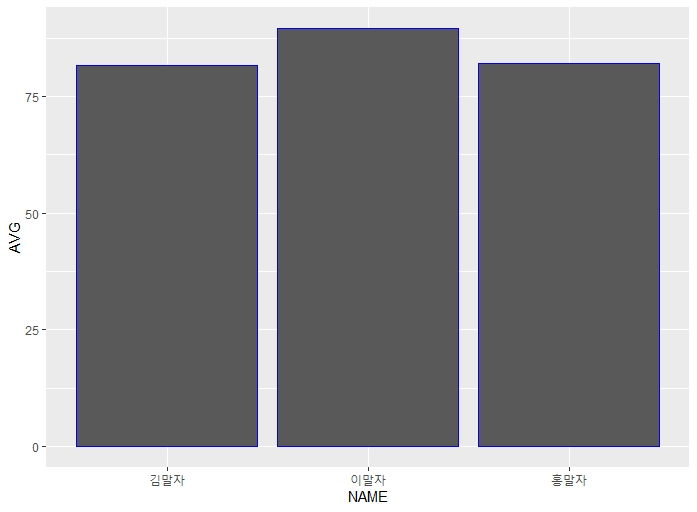

시스템 구성도

안에서 어떤 기술로 어떻게 사용했는지

제목에 사용한 기술작성

제안서 rfb


### bar grapgh

```R
library(ggplot2)
ggplot(mtcars,aes(x=cyl))+geom_bar(width = 0.5)
```


### 데이터의 범주 

``` r
factor(mtcars$cyl)
>Levels:4 6 8 
```


#### x=Factor() 

#### fill = factor()

> 1. 범위에 따라 그래프 출력
> 2. 그래프 안에 그래프 범위 출력

```r
# factor 범주 범위로 그래프 출력
ggplot(mtcars,aes(x=factor(cyl)))+
geom_bar(aes(fill=factor(gear)))+
labs(x="실린더" ,y="기어",title="차량정보")
```


#### if,else

```R
a <- 10
if (a >= 5){
  
}else{
  
}
## a가 5보다 크거나 같으면 100, 5보다 작으면 10
result<-ifelse(a>=5,100,10)
```


```r
##b<-Data group
b<-c(1,2,3,4,5)

## b의 값을 하나씩 출력함
for (i in b) {
 print(i)  
}
```


#### 배열의 각 값에 연산

```r
b<-c(100,90,80,70)
c<-b*0.1

>
[1] 10  9  8  7

> for (i in c) {
+   print(i)
+   
+ }
[1] 10
[1] 9
[1] 8
[1] 7

##짝수행만 선택
d[d$x %% 2 == 0, ]
  x y
2 2 b
4 4 d

> f <- function(df) {
+ df$a <- c(1, 2, 3)
+ return(df)
+ }
> df <- data.frame(a=c(4, 5, 6))
> df <- f(df)  # df의 값을 덮어쓴다.
> df
a
1 1
2 2
3 3
```


```R
func1 <-function(){
  return(10)
  #print(10)
result<-func1()
}
#func1()

##x의 데이터를 순서대로 넣음

a1 <- function(){
  result <- c(1,2,3,4,5)
return (result)
  }
a2 <- function(){
  result <- c(1,2,3,4,5)
  return (result)
}
a3 <- function(){
  result <- c(1,2,3,4,5)
  return (result)
}

func1<-function(x){
  if(x == 10){
    return(a1())
  }else if(x == 20){
    return(a2())
  }else if(x == 30){
    return(a3())
  }else{
    
  }
}
```


```R
> install.packages("Rserve")
...
The downloaded binary packages are in
	C:\Users\i\AppData\Local\Temp\RtmpiE4MDU\downloaded_packages

> Rserve::run.Rserve()
-- running Rserve in this R session (pid=3468), 1 server(s) --
(This session will block until Rserve is shut down)

> Rserve::Rserve(args="--RS-enable-remote")
```


### background 실행

```r
##아래로 실행
> Rserve::run.Rserve()
-- running Rserve in this R session (pid=3468), 1 server(s) --
(This session will block until Rserve is shut down)

> Rserve::Rserve()
Starting Rserve...
 "C:\Users\i\DOCUME~1\R\WIN-LI~1\3.5\Rserve\libs\x64\Rserve.exe" 
 
 > Rserve::Rserve(args="--RS-enable-remote")
```


#### Java - R 연동

> 1. Rstudio실행

 ```R
1. 
##아래로 실행
> Rserve::run.Rserve()
-- running Rserve in this R session (pid=3468), 1 server(s) --
(This session will block until Rserve is shut down)

2.
> Rserve::Rserve()
  Starting Rserve...
 "C:\Users\i\DOCUME~1\R\WIN-LI~1\3.5\Rserve\libs\x64\Rserve.exe" 
 ```

> 2. 이클립스에 라이브러리 탑재


> 3. Rstudio에 function 작성

```R
# 1. 필요한 라이브러리 탑재
library(reshape2)
library(dplyr)
```


```R
함수이름 <- function(){
    {/} <- read.csv()
    :
    :
    result <-
    return(result)
    }

func1 <- function(x){
    if(x==10){
        return(함수이름)
    }else{
        
    }
}
```


```R
# 2. 함수실행하겠다
stavgsum <- function(){

#어떤 파일을 읽어들일건지
st <- read.csv("st.txt",fileEncoding = "UTF-8")

# 평균 구하는 방법
st<-melt(st, id.vars="NAME")
st<-st %>%group_by(NAME) %>% summarise(AVG=mean(value),
                                       TOT=sum(value))
result <- as.data.frame(st)

#result return
return (result)
}

func1<-function(x){
  if(x == 10){
    return(stavgsum())
  }else{
    
  }
}
```


> 4. java 에 R 연동 코드 작성

```java
public class RTest4 {

	public static void main(String[] args) throws REXPMismatchException{
		RConnection rconn = null;
		int arg = 20;
		try {
			rconn = new RConnection("127.0.0.1");
			rconn.setStringEncoding("utf8");
			rconn.eval("source('C:/R/day04/stavgsum.R', encoding = 'UTF-8')");
			// 저장하고 함수호출 
			// R 의 stavgsum 함수 호출
			REXP rexp = rconn.eval("stavgsum()");
           
			//dataframe-> 배열로 꺼내오겠다
			RList rlist =rexp.asList();
            String names [] = rlist.at("NAME").asStrings();
		    int tots [] = rlist.at("TOT").asIntegers();
		    int avgs [] = rlist.at("AVG").asIntegers();
		
		 
		   // 
		    for(int i = 0; i<names.length;i++) {
		    	System.out.println(names[i]+" "+tots[i]+" "+avgs[i]);
		    }
		
		} catch (RserveException e) {
			e.printStackTrace();
		}
		
		System.out.println("connection complete!");
		rconn.close();
	}

}

```


#### EX)

1. RTest3.java & stchart.r

​       -Java Application  실행

​       -학생 별 평균 ggplot2로 히스토그램

​        -이미지 저장(stchart.jpg)


2. RTest4.java & stavg.r

​      -Java Application 동작

​      -학생 별 점수 합계와 평균 구하여 출력


### 평균구해서 그래프로 출력하기

####   1. 평균구하는 두가지 방법

> rowMeans()

```R
st <- read.csv("st.txt",
               header = T,
               fileEncoding = "UTF-8")

st$AVG<-rowMeans(st[,c(2:4)])
```

> melt(), groupby,summarise

```R
#NAME별로 세로 정렬
st<-melt(st, id.vars="NAME")

>st
    NAME variable value
1 이말자       KO    99
2 김말자       KO    88
3 홍말자       KO    67
4 이말자       EN    90
5 김말자       EN    77
6 홍말자       EN    90
7 이말자       MA    80
8 김말자       MA    80
9 홍말자       MA    89

#grounp_by()별 summarise()의 값을 구해라
st<-st %>%group_by(NAME) %>% summarise(AVG=mean(value))
st_avg<-as.data.frame(st)

> st_avg
    NAME      AVG
1 김말자 81.66667
2 이말자 89.66667
3 홍말자 82.00000
```

#### 2. (x,y) 막대그래프

```R
ggplot(st_avg,aes(x=NAME,y=AVG))+geom_col(color="blue")
savePlot(filename = 'C:/R/day04/avgChart.jpeg',type = "jpeg")
```



